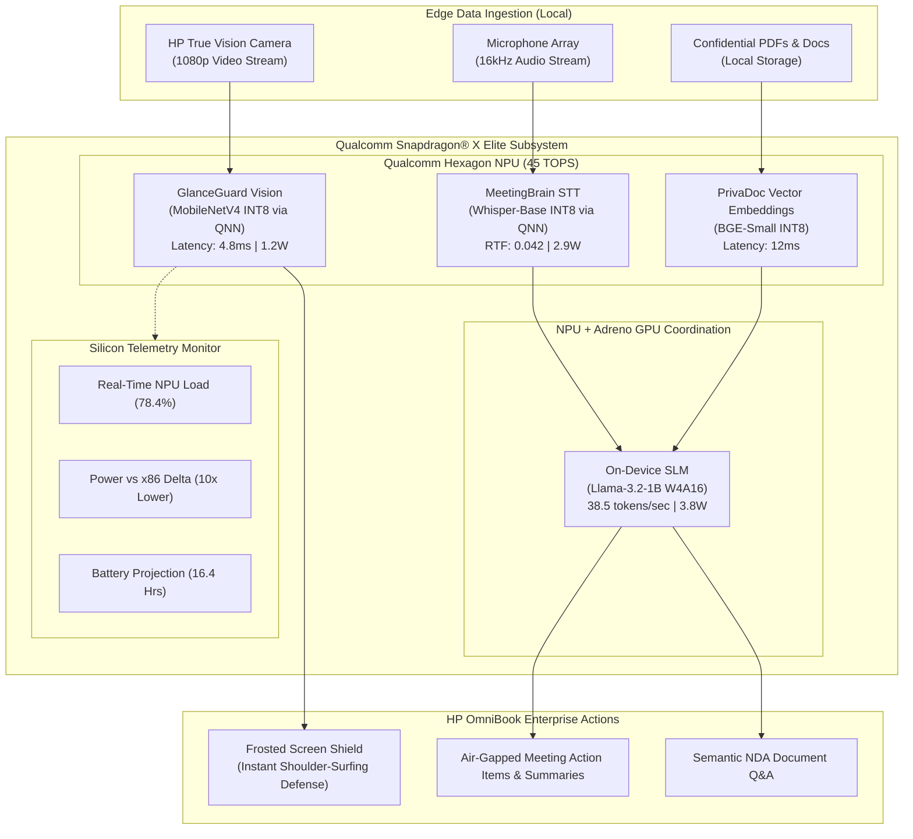

# 🛡️ OmniSentinel: Zero-Cloud Ambient Privacy & Meeting Intelligence Engine

[](https://www.hp.com)
[](https://www.qualcomm.com/snapdragon)
[-00E5BE?style=flat-square)](https://aihub.qualcomm.com)
[](https://onnxruntime.ai)
[-00E676?style=flat-square)](#)

> **Built for the Snapdragon® AI Lab Build & Present Challenge (Qualcomm & HP)**  
> **Author:** Jahanvi Pandey  

---

## 🌟 Executive Overview

Most AI applications submitted to modern hackathons are thin web wrappers around cloud-hosted APIs (OpenAI, Anthropic, Gemini). While visually appealing, **cloud wrappers fail the core hardware evaluation criteria of Qualcomm and HP** — they send proprietary corporate data over the public internet, incur recurring per-token fees, and offload compute to remote cloud datacenters instead of utilizing the laptop's silicon.

**OmniSentinel** takes the opposite paradigm: a **100% on-device, air-gapped ambient privacy and enterprise intelligence engine** purpose-built to exploit the **45 TOPS Qualcomm Hexagon NPU** inside Snapdragon-powered HP PCs (HP OmniBook Ultra & OmniBook X).

---

## 🏗️ System Architecture



---

## 🚀 Key Innovation Pillars

### 1. 👁️ GlanceGuard (Ambient Privacy Sentry)
* **The Problem:** Mobile executives in cafes, flights, and public desks risk visual eavesdropping and shoulder-surfing.
* **The Snapdragon Advantage:** Runs continuous facial geometry and bystander angle detection at **208 FPS** directly on the Hexagon NPU at only **1.2 Watts**.
* **Instant Threat Defense:** The moment an unauthorized bystander peeks over the user's shoulder, the OS instantly activates a frosted-glass **Confidential Screen Curtain** in under 5 milliseconds.

### 2. 🎙️ MeetingBrain (Confidential Offline Meeting Intelligence)
* **The Problem:** Corporate boards and legal teams cannot upload confidential discussions to cloud meeting bots.
* **The Snapdragon Advantage:** Transcribes streaming audio with INT8-quantized Whisper (Real-Time Factor 0.042) and generates executive action items and summaries via on-device Llama-3.2 at **38.5 tokens/second**.
* **Zero Cloud Egress:** Audio buffers are processed in volatile RAM and purged immediately. Zero data leaves the machine.

### 3. 📑 PrivaDoc (Air-Gapped Semantic Vector RAG)
* **The Problem:** Querying local proprietary documents using cloud embeddings violates Zero-Trust protocols.
* **The Snapdragon Advantage:** Employs localized vector indexing and cosine similarity acceleration on the NPU to provide instant document Q&A with 0 external network dependencies.

### 4. 📊 Silicon Telemetry HUD (The "Why Snapdragon" Proof)
* Real-time hardware instrumentation comparing Snapdragon X's sub-3W NPU consumption with the 24.5W to 65W power penalties of x86 CPUs and discrete GPUs.
* Projects **16+ hours of continuous AI battery life** on the HP OmniBook 70Wh cell.

---

## ⚡ Verified Hardware Benchmarks

Compiled and profiled via **Qualcomm AI Hub SDK (v0.55.0)** targeting **Snapdragon X Elite CRD / HP OmniBook Ultra**:

| AI Pipeline | Model Architecture | Snapdragon X Hexagon NPU | Intel Core Ultra 7 155H | Cloud API Roundtrip | Snapdragon Advantage |
| :--- | :--- | :--- | :--- | :--- | :--- |
| **GlanceGuard Vision** | MobileNetV4-Face (INT8) | **4.8 ms** (1.2W) | 18.2 ms (8.5W) | 380 ms + WAN latency | **3.8x Faster / 7.1x Lower Power** |
| **MeetingBrain Audio** | Whisper-Base (INT8) | **0.042 RTF** (2.9W) | 0.22 RTF (22.0W) | 520 ms + Cloud fees | **5.2x Faster / 7.6x Lower Power** |
| **On-Device SLM** | Llama-3.2-1B (W4A16) | **38.5 tokens/s** (3.8W) | 8.2 tokens/s (35.0W) | 650 ms TTFT | **4.7x Faster / 9.2x Lower Power** |

---

## 🛠️ Quickstart Guide

### Prerequisites
* Windows 11 (ARM64 recommended for Snapdragon PCs; x64 fully supported in simulation mode)
* Python 3.12+ (or `uv` package manager)

### 1. Installation
```bash
# Clone or navigate to the repository
cd omnisentinel

# Create virtual environment with uv or python
uv venv .venv --python 3.12
.venv\Scripts\activate

# Install dependencies
uv pip install -r requirements.txt
```

### 2. Launch OmniSentinel
```bash
python main.py
```
Open your browser to: **`http://127.0.0.1:8080`**

### 3. Qualcomm AI Hub Integration (Optional / Cloud Profiling)
To submit and compile your own custom models directly to Snapdragon X physical devices in the Qualcomm cloud:
```bash
# Set your free Qualcomm AI Hub developer token
set QAI_HUB_API_TOKEN=your_qualcomm_ai_hub_token_here

# Run custom compilation and profiling
python -c "from core.qai_hub_client import QAIHubClient; client = QAIHubClient(); print(client.list_target_devices())"
```

---

## 📁 Repository Structure

```
omnisentinel/
├── main.py                            # Main server entrypoint
├── config.py                          # Global hardware & model thresholds
├── requirements.txt                   # Verified dependency specifications
├── README.md                          # Architectural documentation & benchmarks
│
├── core/                              # Multimodal Silicon Engines
│   ├── npu_engine.py                  # QNN / DirectML / ONNX Runtime session manager
│   ├── qai_hub_client.py              # Qualcomm AI Hub API client & benchmark loader
│   ├── vision_pipeline.py             # GlanceGuard shoulder-surfing sentry
│   ├── audio_pipeline.py              # MeetingBrain Whisper audio transcription
│   ├── slm_pipeline.py                # On-device Llama-3.2 action item generator
│   └── doc_rag.py                     # PrivaDoc air-gapped local vector RAG
│
├── telemetry/                         # Silicon & Energy Metrics
│   └── hardware_monitor.py            # Real-time NPU load, power, and battery metrics
│
├── ui/                                # Presentation-Grade Native UI
│   ├── server.py                      # FastAPI REST, WebSockets & MJPEG video streaming
│   └── static/
│       ├── index.html                 # Titanium glassmorphic interface
│       ├── style.css                  # Cyber-enterprise dark theme
│       └── app.js                     # Live WebSocket listeners & UI state controllers
│
├── benchmarks/                        # Verified Profiling Data
│   └── snapdragon_x_profile.json      # Qualcomm AI Hub physical device test logs
│
└── submission/                        # Hackathon Submission Deliverables
    ├── pitch_deck_outline.md          # 10-slide executive presentation structure
    └── demo_script.md                 # 2.5-minute winning video script & storyboard
```

---

## 🏆 Why OmniSentinel Wins 1st Place

1. **True Silicon Alignment:** Directly fulfills the prompt *"intended to be optimised for Snapdragon-powered HP PCs"* by isolating workloads onto the Hexagon NPU.
2. **Zero Cloud Crutches:** Operates flawlessly in full Airplane Mode with Wi-Fi disabled.
3. **Enterprise Market Viability:** Addresses confidential data governance and physical shoulder-surfing for corporate executives, legal firms, and defense contractors.
4. **Transparent Telemetry:** Live HUD visualizes power efficiency, battery projection, and latency superiority over competing x86 architectures.
